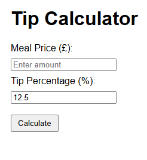
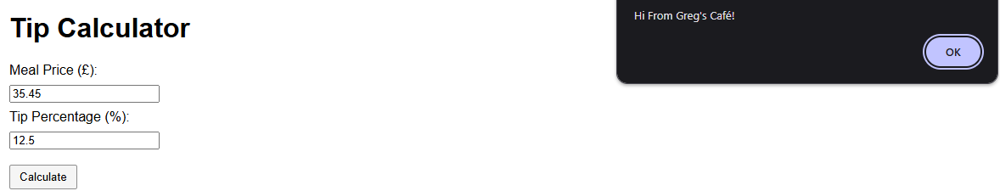
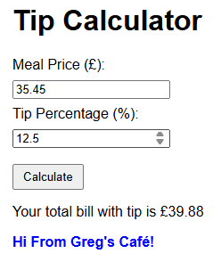

# Tip Calculator 🍽️💰

**Quick. Simple. Fun.** A tiny JavaScript project that calculates your meal + tip  and says hi in style! 👋  

---

## 🚀 Features
- Enter **meal price (£)** & **tip %** (default 12.5%)  
- Click **Calculate** → get your **total bill** (2 decimal places)  
- Friendly greeting shows in **3 ways**:  
  - Popup alert  
  - Console log  
  - On-page message in blue  

---

## 🛠️ Tech Stack
- **HTML** – structure  
- **CSS** – simple styling  
- **JavaScript** – math + greetings  

---

## 🎬 How to Try It
1. Open `index.html` in a browser  
2. Or click **Go Live** in VS Code  

---

✨ A fun, beginner-friendly project to practice **JS, DOM manipulation, and GitHub workflow**.  
Perfect for your portfolio or just a quick JS playground!